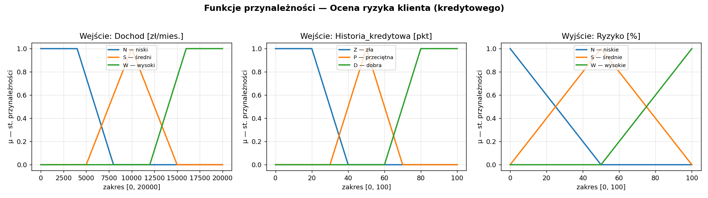
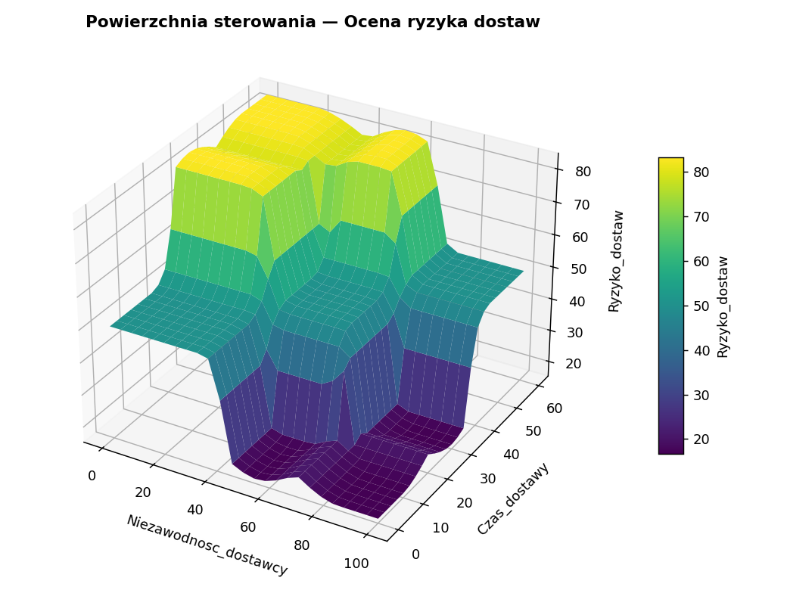

# Systemy rozmyte do oceny ryzyka biznesowego

Projekt zaliczeniowy z przedmiotu **systemy rozmyte** — implementacja w Pythonie
(zamiast MATLAB *Fuzzy Logic Designer*) trzech systemów rozmytych typu
**Mamdani Type‑1**, wspierających decyzje biznesowe w obszarze oceny ryzyka:

| System | Wejście 1 | Wejście 2 | Wyjście |
|---|---|---|---|
| **Ryzyko klienta (kredytowego)** | Dochód `[0–20000] zł/mies.` | Historia kredytowa `[0–100] pkt` | Ryzyko `[0–100] %` |
| **Ryzyko inwestycji** | Stopa zwrotu `[0–30] %` | Zmienność rynku `[0–100]` | Ryzyko `[0–100] %` |
| **Ryzyko dostaw** | Niezawodność dostawcy `[0–100] %` | Czas dostawy `[0–60] dni` | Ryzyko `[0–100] %` |

Każdy system zbudowano w pełni zgodnie z instrukcją projektowania: 3 wartości
lingwistyczne na zmienną, **9 reguł** (wszystkie kombinacje), wnioskowanie
Mamdaniego (AND = `min`, implikacja = `min`, agregacja = `max`) oraz
defuzyfikacja metodą **środka ciężkości** (`centroid`).

> Pełny opis metodyczny (7 kroków schematu projektowania, tabele reguł, analiza
> powierzchni sterowania i wnioski) znajduje się w pliku
> [`docs/sprawozdanie.md`](docs/sprawozdanie.md).

## Stos technologiczny

- [`scikit-fuzzy`](https://pythonhosted.org/scikit-fuzzy/) — silnik wnioskowania
  rozmytego (odpowiednik MATLAB Fuzzy Logic Toolbox),
- `numpy`, `scipy` — obliczenia numeryczne,
- `matplotlib` — wykresy funkcji przynależności i powierzchni sterowania,
- `pytest` — testy weryfikacyjne.

## Struktura projektu

```
system_rozmyty/
├── src/
│   ├── fuzzy_core.py          # generyczny silnik Mamdani + wizualizacja
│   ├── ryzyko_klienta.py      # definicja systemu 1
│   ├── ryzyko_inwestycji.py   # definicja systemu 2
│   └── ryzyko_dostaw.py       # definicja systemu 3
├── tests/
│   └── test_systems.py        # testy poprawności i logiki wnioskowania
├── docs/
│   └── sprawozdanie.md        # sprawozdanie wg schematu projektowania
├── results/                   # wygenerowane wykresy i tabele testów
├── main.py                    # runner / CLI
└── requirements.txt
```

## Uruchomienie

```bash
python3.12 -m venv .venv
source .venv/bin/activate          # Windows: .venv\Scripts\activate
pip install -r requirements.txt
```

Pełna analiza (wykresy funkcji przynależności, powierzchnie sterowania i tabele
testów zapisywane do `results/`):

```bash
python main.py
```

Pojedyncze zapytanie do wybranego systemu:

```bash
python main.py --system klient     --query 3000 80    # -> Ryzyko = 50.00 %
python main.py --system inwestycja --query 8 85       # -> Ryzyko = 81.94 %
python main.py --system dostawy    --query 95 7        # -> Ryzyko = 16.67 %
```

Analiza operatorów (porównanie metod defuzyfikacji centroid/bisector/mom/som/lom):

```bash
python main.py --operators          # zapisuje results/analiza_operatorow.md
```

Testy:

```bash
pytest -q
```

## Przykładowe wyniki

Funkcje przynależności (system *ryzyka klienta*):



Powierzchnia sterowania (system *ryzyka dostaw*):



## Licencja

[MIT](LICENSE)
