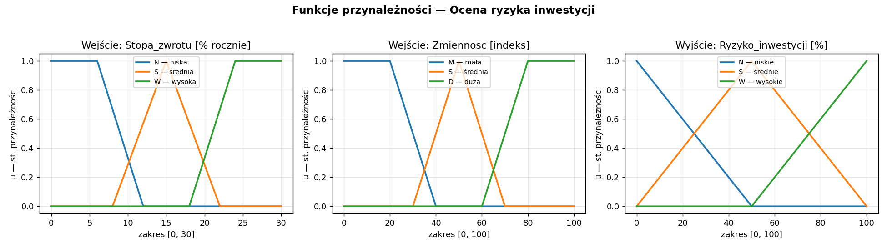
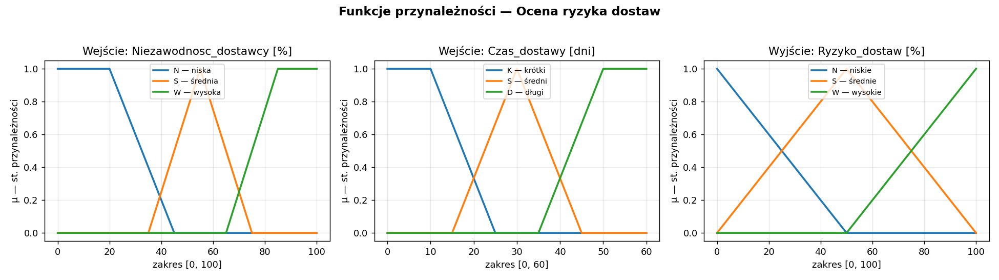
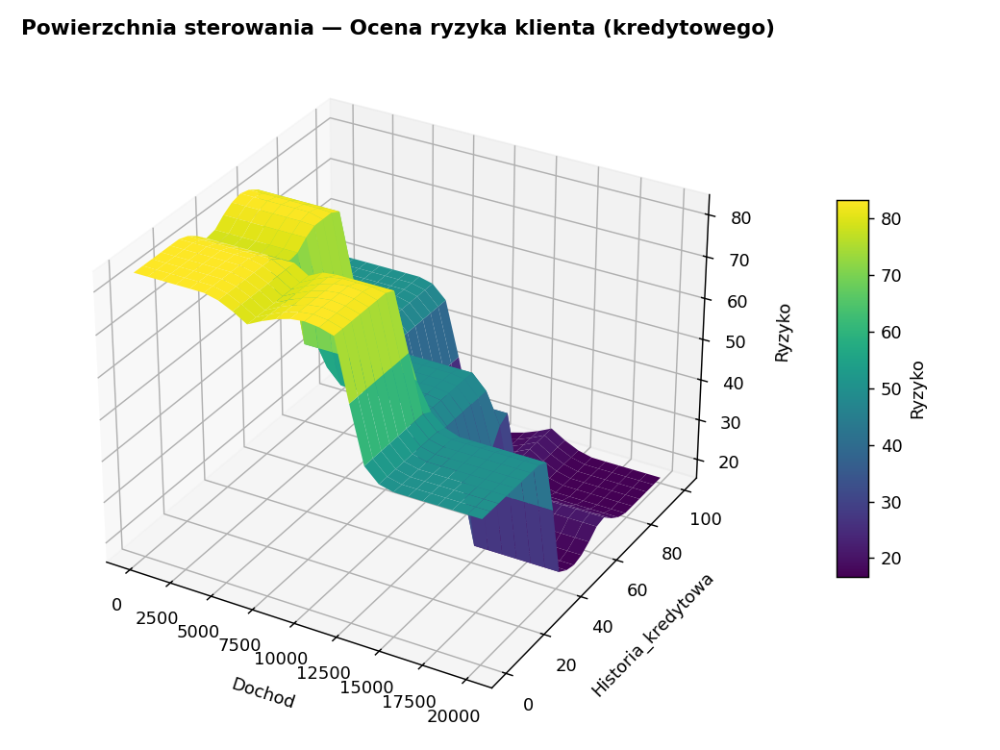
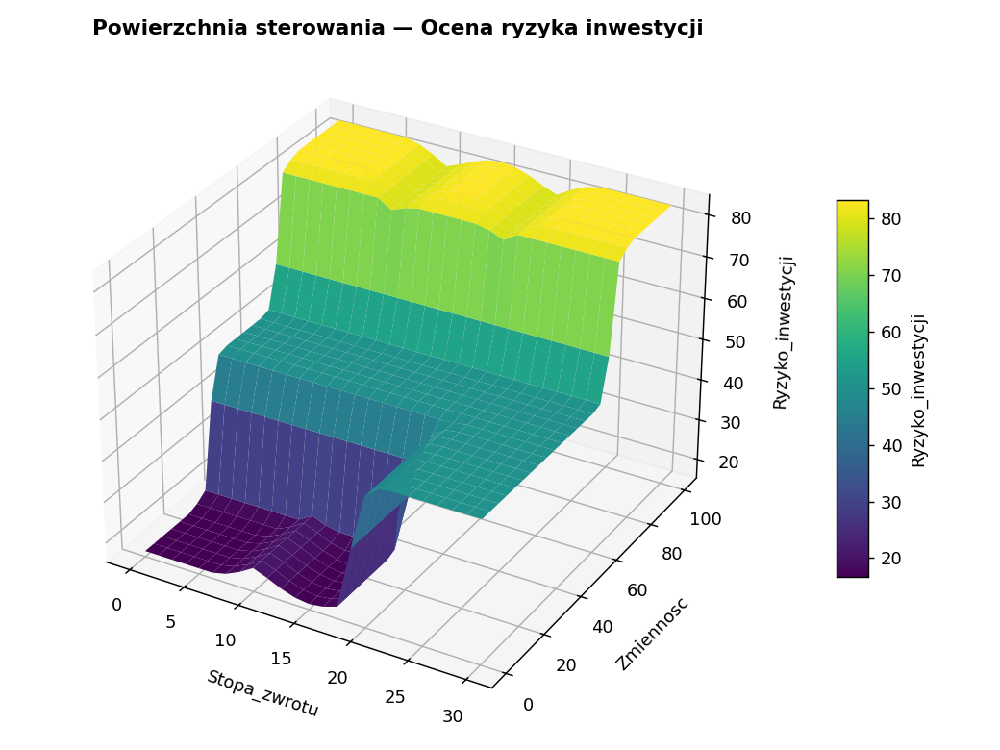

# Sprawozdanie z realizacji projektu systemu rozmytego

**Temat:** Systemy rozmyte wspomagające ocenę ryzyka biznesowego
(ryzyko klienta, ryzyko inwestycji, ryzyko dostaw)
**Środowisko:** Python 3.12 + biblioteka `scikit-fuzzy` (zamiast MATLAB Fuzzy Logic Designer)
**Typ systemu:** Mamdani Type‑1, zbiory rozmyte typu 1
**Repozytorium:** <https://github.com/MarcinJarema/fuzzy-risk-assessment>

**Autorzy (grupa 2‑osobowa):** Marcin Jarema, Marcin Jarema

Sprawozdanie realizuje proces projektowania systemu rozmytego krok po kroku,
zgodnie ze schematem projektowania (kroki 1–7), powtórzony dla trzech
niezależnych problemów biznesowych z obszaru zarządzania ryzykiem.

### Podział pracy

| Część projektu | Osoba odpowiedzialna |
|---|---|
| Opis zastosowania, koncepcja systemów | Marcin Jarema |
| Zmienne lingwistyczne i zbiory rozmyte | Marcin Jarema |
| Baza reguł (wiedza eksperta) | Marcin Jarema |
| Implementacja (silnik, kod, testy) | Marcin Jarema |
| Analiza operatorów i przykłady | Marcin Jarema |
| Wnioski, dokumentacja | Marcin Jarema |

> *Uwaga: powyższy podział należy uzupełnić zgodnie z faktycznym wkładem obu
> uczestników grupy.*

### Mapa kryteriów oceny

| Kryterium oceny | Pkt | Rozdział sprawozdania |
|---|---|---|
| 1. Opis zastosowania systemu | 20 | 1–2 |
| 2a. Zmienne lingwistyczne we/wy | 15 | 3 |
| 2b. Zbiory rozmyte i wartości lingwistyczne | 15 | 3 |
| 2c. Baza reguł | 15 | 4 |
| 3. Przykłady + analiza operatorów | 20 | 6 |
| 4. Wnioski | 15 | 7 |

---

## 1. Określenie problemu i celu systemu

Ocena ryzyka jest klasycznym zagadnieniem, w którym decyzje podejmuje się na
podstawie nieostrych, słownych kryteriów eksperckich („niski dochód”, „duża
zmienność rynku”, „mało niezawodny dostawca”). Logika rozmyta pozwala
sformalizować tę wiedzę bez konieczności posiadania danych uczących.

Zaprojektowano **trzy** systemy rozmyte, każdy szacujący poziom ryzyka w skali
`[0–100] %`:

1. **Ryzyko klienta (kredytowego)** — wspomaga decyzję o przyznaniu kredytu lub
   limitu kupieckiego.
2. **Ryzyko inwestycji** — ocenia ryzyko instrumentu/projektu inwestycyjnego.
3. **Ryzyko dostaw** — ocenia ryzyko zakłóceń w łańcuchu dostaw.

Każdy system działa w oparciu o wiedzę eksperta wyrażoną w postaci reguł
„JEŻELI … TO …”, bez wykorzystania danych historycznych.

## 2. Określenie struktury systemu

Wszystkie trzy systemy mają identyczną strukturę logiczną (dwa wejścia → jedno
wyjście), różniąc się jedynie znaczeniem zmiennych:

```
   Wejście 1  ─┐
               ├──►  System rozmyty (Mamdani Type-1, baza 9 reguł)  ──►  Ryzyko [0–100] %
   Wejście 2  ─┘
```

| System | Wejście 1 | Wejście 2 | Wyjście |
|---|---|---|---|
| Klient | `Dochod` [0–20000] zł/mies. | `Historia_kredytowa` [0–100] pkt | `Ryzyko` [0–100] % |
| Inwestycja | `Stopa_zwrotu` [0–30] % | `Zmiennosc` [0–100] | `Ryzyko_inwestycji` [0–100] % |
| Dostawy | `Niezawodnosc_dostawcy` [0–100] % | `Czas_dostawy` [0–60] dni | `Ryzyko_dostaw` [0–100] % |

## 3. Definicja zmiennych lingwistycznych i ich zakresów

Dla każdej zmiennej zdefiniowano **trzy** wartości lingwistyczne. Zgodnie z
instrukcją, skrajne zbiory każdej zmiennej wejściowej opisano funkcjami
**trapezowymi**, a zbiór środkowy funkcją **trójkątną**. Zmienne wyjściowe
opisano trzema funkcjami **trójkątnymi** pokrywającymi cały zakres `[0–100]`.

### 3.1. System „Ryzyko klienta”

| Zmienna | Wartość | Typ MF | Parametry |
|---|---|---|---|
| Dochod | N – niski | trapezowa | [0, 0, 4000, 8000] |
| Dochod | S – średni | trójkątna | [5000, 10000, 15000] |
| Dochod | W – wysoki | trapezowa | [12000, 16000, 20000, 20000] |
| Historia_kredytowa | Z – zła | trapezowa | [0, 0, 20, 40] |
| Historia_kredytowa | P – przeciętna | trójkątna | [30, 50, 70] |
| Historia_kredytowa | D – dobra | trapezowa | [60, 80, 100, 100] |
| Ryzyko | N / S / W | trójkątna | [0,0,50] / [0,50,100] / [50,100,100] |


### 3.2. System „Ryzyko inwestycji”

| Zmienna | Wartość | Typ MF | Parametry |
|---|---|---|---|
| Stopa_zwrotu | N – niska | trapezowa | [0, 0, 6, 12] |
| Stopa_zwrotu | S – średnia | trójkątna | [8, 15, 22] |
| Stopa_zwrotu | W – wysoka | trapezowa | [18, 24, 30, 30] |
| Zmiennosc | M – mała | trapezowa | [0, 0, 20, 40] |
| Zmiennosc | S – średnia | trójkątna | [30, 50, 70] |
| Zmiennosc | D – duża | trapezowa | [60, 80, 100, 100] |
| Ryzyko_inwestycji | N / S / W | trójkątna | [0,0,50] / [0,50,100] / [50,100,100] |



### 3.3. System „Ryzyko dostaw”

| Zmienna | Wartość | Typ MF | Parametry |
|---|---|---|---|
| Niezawodnosc_dostawcy | N – niska | trapezowa | [0, 0, 20, 45] |
| Niezawodnosc_dostawcy | S – średnia | trójkątna | [35, 55, 75] |
| Niezawodnosc_dostawcy | W – wysoka | trapezowa | [65, 85, 100, 100] |
| Czas_dostawy | K – krótki | trapezowa | [0, 0, 10, 25] |
| Czas_dostawy | S – średni | trójkątna | [15, 30, 45] |
| Czas_dostawy | D – długi | trapezowa | [35, 50, 60, 60] |
| Ryzyko_dostaw | N / S / W | trójkątna | [0,0,50] / [0,50,100] / [50,100,100] |



Funkcje przynależności pokrywają cały zakres numeryczny każdej zmiennej
(weryfikowane testem `test_pokrycie_przestrzeni_wejsc`), dzięki czemu dla
dowolnej wartości wejścia aktywowana jest co najmniej jedna reguła.

## 4. Utworzenie bazy reguł (wiedzy eksperta)

Każdy system zawiera **9 reguł** odpowiadających wszystkim kombinacjom wartości
lingwistycznych dwóch wejść (3 × 3). Wszystkie reguły mają wagę **1**, a
przesłanki łączone są spójnikiem **AND**.

### 4.1. Ryzyko klienta
*Logika: niski dochód lub zła historia podnoszą ryzyko; wysoki dochód i dobra historia je obniżają.*

| Nr | Dochod | Historia_kredytowa | Ryzyko |
|---|---|---|---|
| 1 | N (niski) | Z (zła) | W (wysokie) |
| 2 | N (niski) | P (przeciętna) | W (wysokie) |
| 3 | N (niski) | D (dobra) | S (średnie) |
| 4 | S (średni) | Z (zła) | W (wysokie) |
| 5 | S (średni) | P (przeciętna) | S (średnie) |
| 6 | S (średni) | D (dobra) | N (niskie) |
| 7 | W (wysoki) | Z (zła) | S (średnie) |
| 8 | W (wysoki) | P (przeciętna) | N (niskie) |
| 9 | W (wysoki) | D (dobra) | N (niskie) |

### 4.2. Ryzyko inwestycji
*Logika: ryzyko rośnie głównie ze zmiennością rynku; bardzo wysoka obiecywana stopa zwrotu sygnalizuje dodatkowe ryzyko (premia za ryzyko).*

| Nr | Stopa_zwrotu | Zmiennosc | Ryzyko |
|---|---|---|---|
| 1 | N (niska) | M (mała) | N (niskie) |
| 2 | N (niska) | S (średnia) | S (średnie) |
| 3 | N (niska) | D (duża) | W (wysokie) |
| 4 | S (średnia) | M (mała) | N (niskie) |
| 5 | S (średnia) | S (średnia) | S (średnie) |
| 6 | S (średnia) | D (duża) | W (wysokie) |
| 7 | W (wysoka) | M (mała) | S (średnie) |
| 8 | W (wysoka) | S (średnia) | S (średnie) |
| 9 | W (wysoka) | D (duża) | W (wysokie) |

### 4.3. Ryzyko dostaw
*Logika: niska niezawodność dostawcy = wysokie ryzyko niezależnie od czasu; przy wysokiej niezawodności długi czas dostawy podnosi ryzyko jedynie umiarkowanie.*

| Nr | Niezawodnosc_dostawcy | Czas_dostawy | Ryzyko |
|---|---|---|---|
| 1 | N (niska) | K (krótki) | S (średnie) |
| 2 | N (niska) | S (średni) | W (wysokie) |
| 3 | N (niska) | D (długi) | W (wysokie) |
| 4 | S (średnia) | K (krótki) | N (niskie) |
| 5 | S (średnia) | S (średni) | S (średnie) |
| 6 | S (średnia) | D (długi) | W (wysokie) |
| 7 | W (wysoka) | K (krótki) | N (niskie) |
| 8 | W (wysoka) | S (średni) | N (niskie) |
| 9 | W (wysoka) | D (długi) | S (średnie) |

## 5. Ustalenie parametrów wnioskowania

Dla wszystkich systemów przyjęto klasyczną konfigurację modelu Mamdaniego
(zgodną ze schematem projektowania):

| Parametr | Wartość |
|---|---|
| Operator AND (t‑norma) | `min` |
| Metoda interpretacji (implikacji) reguł | `min` |
| Metoda agregacji konkluzji | `max` |
| Metoda defuzyfikacji (wyostrzania) | środek ciężkości (`centroid`) |

W implementacji odpowiada to domyślnym ustawieniom `scikit-fuzzy` dla zmiennej
wyjściowej tworzonej z `defuzzify_method="centroid"`.

## 6. Analiza wnioskowania i weryfikacja systemu

### 6.1. Przykład wnioskowania (rule inference)

Rozpatrzmy system **ryzyka klienta** dla wejść `Dochod = 2000`, `Historia = 15`:

- `Dochod = 2000` należy w pełni do zbioru **N – niski** (μ ≈ 1), brak
  przynależności do pozostałych.
- `Historia = 15` należy w pełni do zbioru **Z – zła** (μ ≈ 1).
- Aktywowana zostaje reguła nr 1: *JEŻELI Dochod = N AND Historia = Z TO Ryzyko = W*.
- Po agregacji i defuzyfikacji metodą środka ciężkości otrzymujemy
  **Ryzyko = 83,33 %** — wartość prawidłowo wskazująca klienta wysokiego ryzyka.

### 6.2. Powierzchnie sterowania (control surface)

Powierzchnie przedstawiają wartość wyjściową ryzyka w funkcji obu wejść i
potwierdzają zgodność zachowania systemów z logiką reguł.

| Ryzyko klienta | Ryzyko inwestycji | Ryzyko dostaw |
|---|---|---|
|  |  |  |

- **Klient:** ryzyko maleje wraz ze wzrostem dochodu i poprawą historii kredytowej.
- **Inwestycja:** ryzyko rośnie głównie ze zmiennością rynku; wysoka stopa
  zwrotu lekko podnosi ryzyko nawet przy małej zmienności.
- **Dostawy:** ryzyko jest wysokie przy niskiej niezawodności dostawcy i maleje
  wraz z jej wzrostem; długi czas dostawy dodatkowo je podwyższa.

### 6.3. Testowanie systemu

Dla każdego systemu sprawdzono pięć reprezentatywnych kombinacji wejść
(skrajnych i pośrednich). Wyniki są spójne z oczekiwaniami eksperta:

**Ryzyko klienta**

| Dochod [zł/mies.] | Historia [pkt] | Ryzyko [%] |
|---|---|---|
| 2000 | 15 | 83,33 |
| 3000 | 80 | 50,00 |
| 10000 | 50 | 50,00 |
| 16000 | 90 | 16,67 |
| 18000 | 10 | 50,00 |

**Ryzyko inwestycji**

| Stopa_zwrotu [%] | Zmiennosc | Ryzyko [%] |
|---|---|---|
| 4 | 15 | 16,67 |
| 8 | 85 | 81,94 |
| 15 | 50 | 50,00 |
| 27 | 20 | 50,00 |
| 27 | 90 | 83,33 |

**Ryzyko dostaw**

| Niezawodnosc [%] | Czas [dni] | Ryzyko [%] |
|---|---|---|
| 20 | 8 | 50,00 |
| 15 | 50 | 83,33 |
| 55 | 30 | 50,00 |
| 95 | 7 | 16,67 |
| 90 | 55 | 50,00 |

Dodatkowo poprawność systemów potwierdza zestaw 15 testów automatycznych
(`pytest`), sprawdzających m.in. kompletność bazy reguł, pełne pokrycie zakresów
zmiennych, zakres wartości wyjściowych oraz **monotoniczność** (wzrost
zmienności rynku nie obniża szacowanego ryzyka inwestycji).

### 6.4. Analiza operatorów wnioskowania

System Mamdaniego można skonfigurować różnymi operatorami na każdym etapie
wnioskowania. W projekcie przyjęto klasyczny zestaw (AND = `min`, implikacja =
`min`, agregacja = `max`, defuzyfikacja = `centroid`), a poniżej zbadano wpływ
zmiany operatorów na wynik.

**a) Operator AND (t‑norma) i implikacja.**
Przesłanki reguł łączone są spójnikiem AND realizowanym jako t‑norma `min` —
stopień aktywacji reguły to minimum przynależności obu wejść. Alternatywą jest
t‑norma iloczynowa (`prod`), która daje „łagodniejsze" aktywacje (iloczyn ≤
minimum), przez co reguły o częściowym dopasowaniu wpływają na wynik słabiej.
Analogicznie implikacja `min` „obcina" konkluzję na poziomie aktywacji reguły,
a `prod` ją skaluje. Dla przyjętych funkcji przynależności, gdzie w większości
punktów dominuje jedna reguła, oba warianty dają zbliżone wyniki; różnice
ujawniają się w strefach nakładania się zbiorów.

**b) Metoda defuzyfikacji (wyostrzania).**
Największy wpływ na konkretną wartość liczbową ma metoda defuzyfikacji.
Porównano pięć metod dostępnych w `scikit-fuzzy` dla tych samych przykładów
(pełne wyniki: `results/analiza_operatorow.md`):

| Metoda | Opis |
|---|---|
| `centroid` | środek ciężkości pola wynikowego (domyślna) |
| `bisector` | dwusieczna dzieląca pole na dwie równe części |
| `mom` | środek przedziału maksimum (*mean of maximum*) |
| `som` | najmniejsza wartość maksimum (*smallest of maximum*) |
| `lom` | największa wartość maksimum (*largest of maximum*) |

Przykład — system **ryzyka klienta**:

| Dochod | Historia | centroid | bisector | mom | som | lom |
|---|---|---|---|---|---|---|
| 2000 | 15 | 83,33 | 85,36 | 100 | 100 | 100 |
| 3000 | 80 | 50,00 | 50,00 | 50 | 50 | 50 |
| 16000 | 90 | 16,67 | 14,64 | 0 | 0 | 0 |

Przykład — system **ryzyka inwestycji**:

| Stopa_zwrotu | Zmiennosc | centroid | bisector | mom | som | lom |
|---|---|---|---|---|---|---|
| 4 | 15 | 16,67 | 14,64 | 0 | 0 | 0 |
| 8 | 85 | 81,94 | 83,33 | 91,52 | 83,33 | 100 |
| 27 | 90 | 83,33 | 85,36 | 100 | 100 | 100 |

**Wnioski z analizy operatorów:**

- `centroid` i `bisector` dają wyniki bardzo zbliżone i „wygładzone" — biorą pod
  uwagę całą powierzchnię wynikową, dzięki czemu reagują płynnie na zmianę
  wejść. To czyni je najlepszym wyborem dla oceny ryzyka, gdzie zależy nam na
  proporcjonalnej, ciągłej skali.
- Metody maksimum (`mom`, `som`, `lom`) zwracają wartości skrajne (np. 0 lub
  100), gdy w danym punkcie dominuje pojedyncza reguła. Tracą informację o
  „stopniu" ryzyka i powodują skokową, mało intuicyjną charakterystykę —
  nieodpowiednią dla tego zastosowania.
- Gdy aktywna jest tylko jedna, symetryczna reguła (np. wynik „średnie"),
  wszystkie metody zgadzają się na wartości 50 — różnice pojawiają się dopiero
  przy asymetrycznym rozkładzie aktywacji reguł.

Potwierdza to zasadność domyślnego wyboru **środka ciężkości** jako metody
defuzyfikacji w zaprojektowanych systemach.

## 7. Wnioski i dalsze kroki

- Trzy zaprojektowane systemy rozmyte poprawnie odwzorowują ekspercką logikę
  oceny ryzyka, a uzyskiwane wartości wyjściowe są intuicyjne i spójne dla
  przypadków skrajnych oraz pośrednich.
- Analiza powierzchni sterowania nie wykazała nieciągłości ani „martwych stref”
  — funkcje przynależności pokrywają całą przestrzeń zmiennych wejściowych.
- Implementacja w Pythonie z biblioteką `scikit-fuzzy` okazała się w pełni
  równoważna procesowi z MATLAB Fuzzy Logic Designer, a dodatkowo umożliwia
  automatyzację testów, wersjonowanie i łatwą integrację z aplikacjami.
- **Możliwe rozszerzenia:**
  - dostrojenie kształtu funkcji przynależności lub wag reguł na podstawie
    danych historycznych (tuning),
  - dodanie trzeciej zmiennej wejściowej (np. wielkości ekspozycji),
  - złożenie trzech systemów w jeden zagregowany wskaźnik ryzyka przedsiębiorstwa,
  - eksport modeli do formatu wielokrotnego użytku i udostępnienie przez API.
